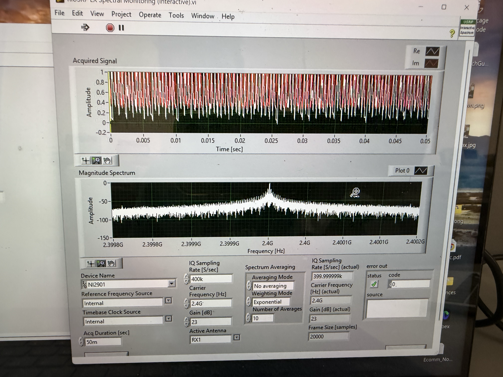
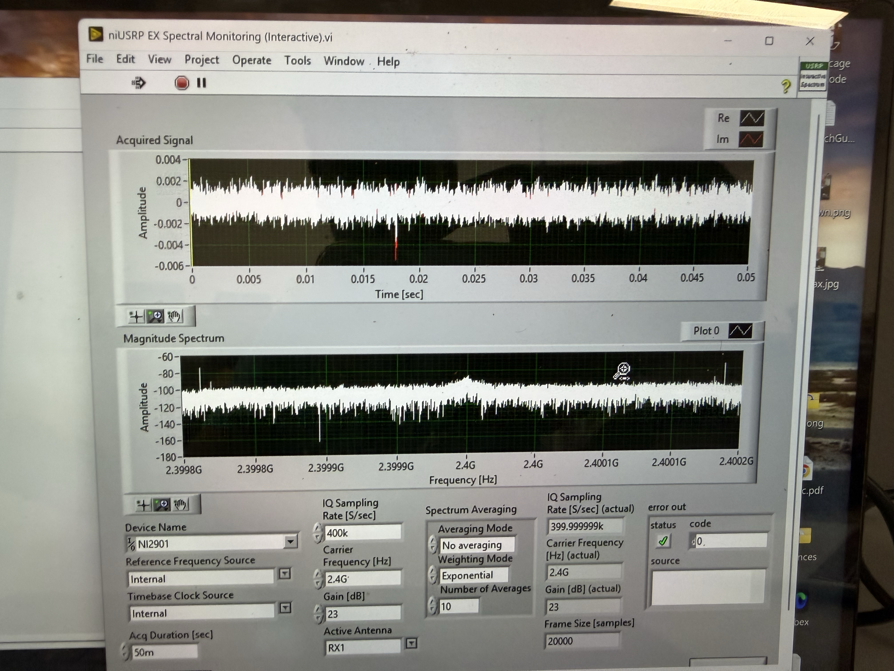

### Section Questions
#### 3.1
1. NI USRP ID: NI2901
2. When obstructed, the frequency response appears uniform at a **very low amplitude** -- relatively equal strength of all frequencies which is like white-noise. Correspondingly, the time-domain plot appears completely noisy with no discernable sine wave, also a **low amplitude** under 2e-3. We no longer see a peak at the expected 2.4 GHz. See the two pictures attached which support my statements.

	1. **Un-obstructed** (above), **Obstructed** (below)

#### 3.2
1. Three outputs from **Fetch Rx Data (poly).vi**. The **Datatype** is epxressed as sub-bullets of the **Name**
	1. ==Data==
		1. **Double**, t0, start time of acquired array
		2. **Double**, dT, time step between samples in the acquired array
		3. **{CDB}**, Y, the actual acquired array expressed in complex values and comprise the waveform
	2. ==Timestamp==
		1. **U64** -- whole_seconds
		2. **Double** -- fractional_seconds
		3. These are combined into a "timestamp" expressed as **whole_seconds.fractional_seconds** of the first sample received
	3. ==Error Out==
		1. Standard Error Type used by most VIs
#### 3.3
1. The instrument only supports IQ rates that are integer factors/decimations of the fixed ADC rate of 100 MS/s. As a result, there is a finite list of supported frequencies. Any unsupported request gets coerced into the nearest acceptable frequency. That is why the **Configure Signal.vi** outputs "coerced rate" (feedback to the user). 

### Concluding Questions
1. *Answered above*
2. Initially had some hardware troubles (bad USB dongle or bad USB driver on my laptop). Tried a whole bunch of dongles until it worked. 
3. On transmit, the USRP is configured with a device/IP address, carrier frequency, IQ rate, and gain (via `niUSRP Configure Signal.vi`), and is fed a baseband IQ waveform to send out a selected TX antenna. It upconverts and outputs that waveform as an analog signal through the RF front-end.
4. On receive, the USRP is configured with the **same** RF parameters (IP address, carrier frequency, IQ rate, gain, active antenna) plus a requested number of samples. The hardware downconverts and digitizes the incoming RF signal through DDC. Acquired signal is captured as a complex waveform with the parameters/types specified in 3.2.
5. Did not run into any issues with LabVIEW/VI setup or while running the TX/RX experiments. Took some time to get used to the LabVIEW programming interface: creating and wiring up nodes.

